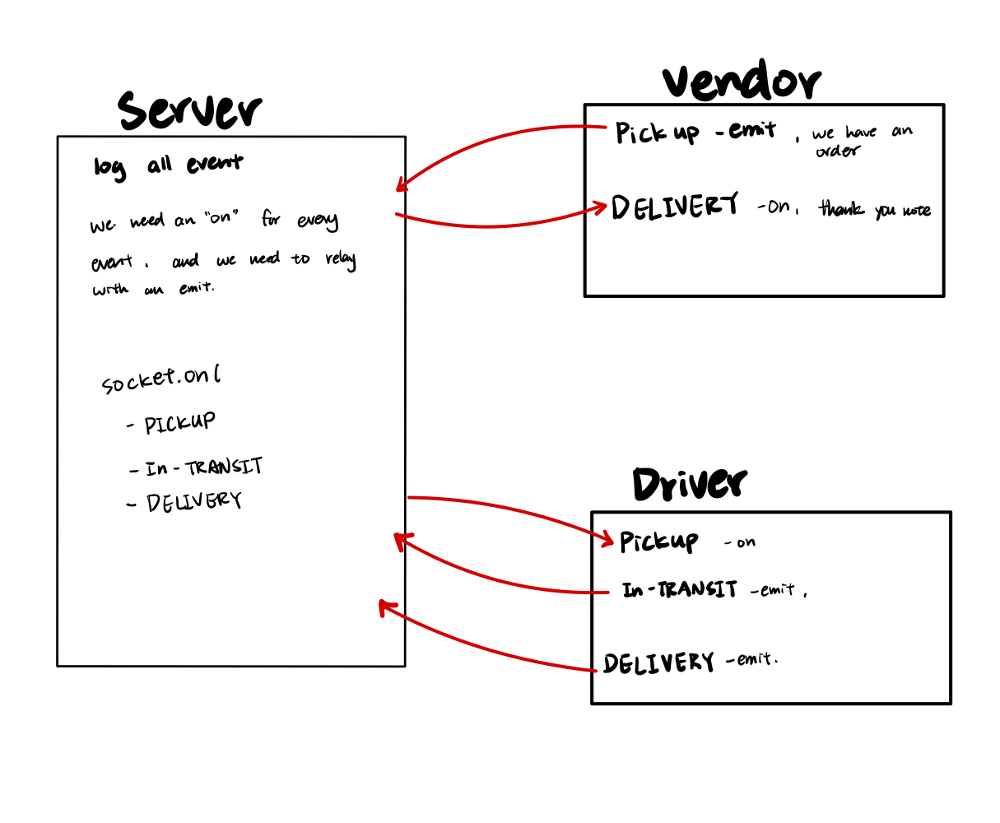

# LAB - Class 12

## Project: CAPs

### Author: Student/Group Name

### Problem Domain  

Concise Description of why this app exists

### Links and Resources

- [GitHub Actions ci/cd](https://github.com/rkgallaway/server-deployment-practice-d51/actions)

### Setup

#### `.env` requirements (where applicable)

PORT=3001

#### How to initialize/run your application (where applicable)

to run the application
go to server folder and run `node index.js` to start the server
go into client folder and run `node index.js` to start the socket.io

#### Features / Routes

N/A

#### Tests

- How do you run tests? Any tests of note?
  - jest `run npm test filename.test.js`

- Describe any tests that you did not complete, skipped, etc
  skipped the handler tests.

#### UML

